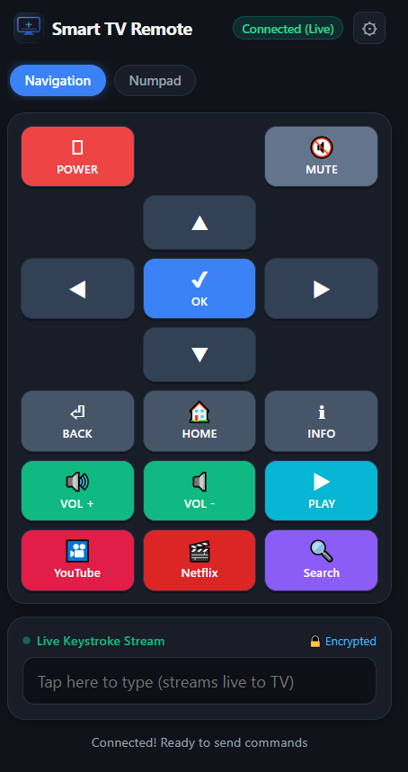

# 📺 LiLyGO Wi-Fi TV Remote

  <b>🇬🇧 English</b> | <a href="README.fr.md">🇫🇷 Français</a>

Turn your smartphone into a fast, responsive remote control and wireless keyboard for your Smart TV, streaming box, or PC—powered by the pocket-sized **LilyGO T-Dongle-S3** USB stick.

  

---

## 🎨 Companion Remote Designer

Customize your remote layout, arrange buttons, or program automated shortcut macros directly in your web browser:  
👉 **[Launch Online Remote Designer](https://sblaisdev.github.io/lilygo-wifi-tv-remote/)**

---

## ✨ Features for Everyday Users

- **📱 Turn Any Phone into a TV Remote**: Open a web link on your iPhone, Android phone, tablet, or laptop to instantly control your TV. No app store downloads, accounts, or Bluetooth pairing required.
- **⌨️ Fast, Hassle-Free Typing on Your TV**: Never hunt-and-peck individual letters on an awkward on-screen TV keyboard again. Use your phone's full keyboard to effortlessly type search queries, passwords, and web addresses directly to your TV in real time.
- **🔌 100% Plug-and-Play (Zero Drivers)**: Plug the dongle into any standard USB port on your TV, media player, streaming box, or computer. Your device recognizes it instantly as a standard USB keyboard and media controller—no software installation needed.
- **🎨 Visual Remote Customization**: Use the built-in [Remote Designer](https://sblaisdev.github.io/lilygo-wifi-tv-remote/) to arrange buttons, create quick-access buttons for apps like Netflix and YouTube, or switch between TV and PC modes.
- **📲 Install as a Home Screen App (PWA)**: Save the remote to your phone's home screen with one tap. It opens full-screen just like a native app with fast response and vibration feedback.
- **🌐 Works at Home and on the Go**: Connect it to your home Wi-Fi for everyday use, or let it generate its own private Wi-Fi hotspot when staying in hotels or dorms.
- **🔄 1-Click Wireless Updates**: Keep your device up-to-date with a single tap from your phone's browser over Wi-Fi. No cables or programming knowledge needed.

---

## 📖 User Guides / Guides d'utilisation

### 🚀 Simple Quick Start / Démarrage Rapide
- 🇬🇧 **[Getting Started Guide (Simple Terms)](GETTING_STARTED.md)** : Step-by-step setup and remote access in plain, non-technical language.
- 🇫🇷 **[Guide de Démarrage Rapide (Termes Simples)](DEMARRAGE_RAPIDE.md)** : Configuration et accès à la télécommande expliqués simplement.

### 📚 Full Technical Documentation / Documentation Complète
- 🇬🇧 **[Full User Guide](USER_GUIDE_EN.md)**: Hardware architecture, PWA installation, security & crypto, factory reset, troubleshooting.
- 🇫🇷 **[Guide Complet de l'utilisateur](USER_GUIDE_FR.md)** : Architecture matérielle, installation PWA, sécurité et cryptographie, réinitialisation, dépannage.

---

## 🛠️ Technical Features & Security Architecture

1. **Physical Proximity Barrier & Device Pairing**: Setup Access Point (`TV-Remote-Setup`) uses a cryptographically secure 8-character random password generated via the ESP32-S3 TRNG and shown **exclusively on the physical 160×80 LCD**. Optional **Hardware Device Pairing (Method B)** requires physical button confirmation on the dongle before any client device can transmit keystrokes.
2. **Zero Cleartext Credentials & Fail-Closed Security**: Wi-Fi credentials are encrypted using **AES-256 CTR** via the ESP32-S3 **Hardware HMAC Peripheral** (`KEY0`–`KEY5`) with automatic key slot reuse and strict fail-closed validation (no unencrypted fallbacks).
3. **In-Transit Keystroke Encryption**: Keystrokes transmitted over WebSocket/HTTP are encrypted client-side using browser-native **WebCrypto AES-CTR** before broadcast over the local network.
4. **Sub-Millisecond Web Remote**: WebSocket-powered remote control with D-Pad navigation, media controls, volume, power, and live phone-to-TV typing.
5. **Standalone AP or Station Mode**: Connect to your existing home Wi-Fi or configure a permanent standalone hotspot for direct phone-to-TV control while traveling.
6. **PWA Ready**: Installable to iOS and Android home screens with a custom neon TV remote icon and web app manifest.
7. **Fail-Safe Factory Reset**: 10-second button hold with two-step confirmation erases NVS flash while preserving hardware eFuses.
8. **Universal Companion Studio & DuckyScript Macros**: An intuitive layout & macro designer companion app hosted on [GitHub Pages](https://sblaisdev.github.io/lilygo-wifi-tv-remote/) (or locally in `docs/` and redirected from `/designer`) to visually build custom button grids and deploy automated keystroke macros directly via Wi-Fi, USB, or JSON export. Profiles are saved on-chip in LittleFS with automatic MicroSD card detection.
9. **1-Click Cloud OTA & Test Device Channel**: Over-the-air firmware updates directly from GitHub Releases with zero developer stack needed. Features version selection with automatic rollback support, automated CI release binaries, offline manual `.bin` fallback, and a dedicated **Test Device Mode** toggle to test experimental and pre-release builds safely.

