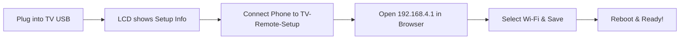
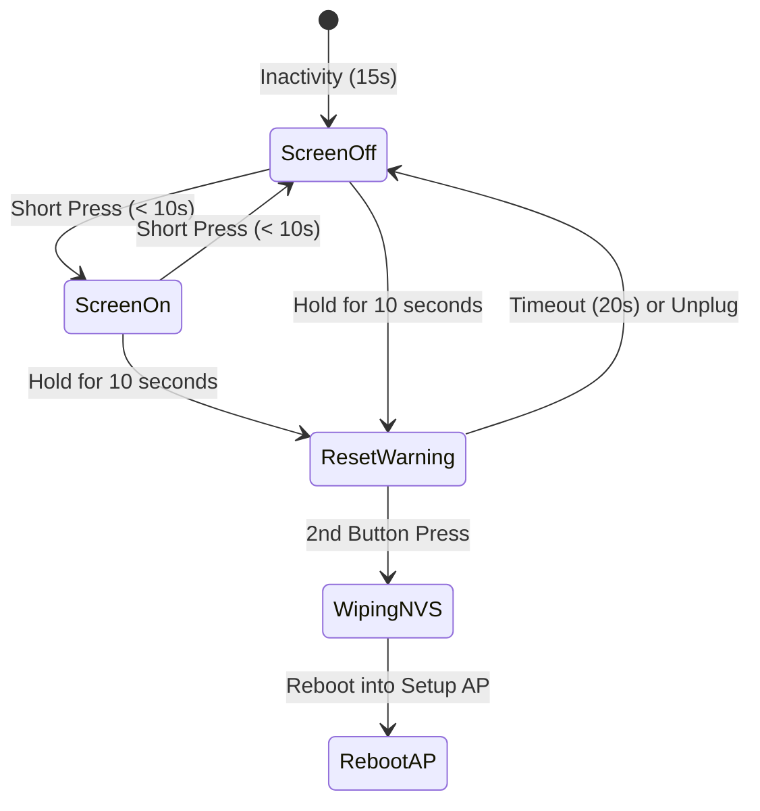

# LilyGO T-Dongle-S3 TV Remote & Keyboard — User Guide

Welcome to the user manual for your **LilyGO T-Dongle-S3 TV Remote & Wireless Keyboard**. This device turns your LilyGO USB dongle into an ultra-low latency, hardware-level USB HID remote control and wireless keyboard for your Smart TV, streaming box, or media PC, controllable from any smartphone, tablet, or web browser.

---

## Table of Contents
1. [Overview & Features](#1-overview--features)
2. [Hardware Requirements & Compatibility](#2-hardware-requirements--compatibility)
3. [First-Time Setup (Wi-Fi Provisioning)](#3-first-time-setup-wi-fi-provisioning)
4. [Using the Web Remote Control](#4-using-the-web-remote-control)
5. [Installing as a Web App (PWA)](#5-installing-as-a-web-app-pwa)
6. [Physical Button Functions & Factory Reset](#6-physical-button-functions--factory-reset)
7. [Security & Cryptographic Architecture](#7-security--cryptographic-architecture)
8. [Troubleshooting & Frequently Asked Questions](#8-troubleshooting--frequently-asked-questions)

---

## 1. Overview & Features

- **Driverless USB HID Control**: Emulates a native standard USB keyboard and consumer multimedia controller. Plugs directly into any USB port without installing drivers or software on the host TV.
- **Physical Proximity Barrier**: Protects your setup access point with a cryptographically secure 8-character random password generated via the ESP32-S3 True Random Number Generator (TRNG) and shown **only** on the built-in color LCD.
- **Hardware-Encrypted Storage**: Your home Wi-Fi credentials are encrypted using **AES-256 CTR** with an encryption key derived from the ESP32-S3 **Hardware HMAC Peripheral** (`KEY0`–`KEY5`). No cleartext passwords ever touch flash memory.
- **Real-Time Web Remote**: Instantaneous responsiveness using WebSocket communication (`ws://<ip>:81`) with fallback to HTTP REST (`http://<ip>:80`).
- **Live Typing & Search**: Type text directly from your phone's native keyboard into TV search bars, login fields, and streaming apps.
- **Progressive Web App (PWA)**: Installable directly to your phone's home screen with a custom neon TV remote icon and full-screen immersive UI.
- **Smart Power & Display Management**: High-visibility 160×80 IPS LCD with auto-sleep after 15 seconds during normal use, and continuous backlight during setup mode.

---

## 2. Hardware Requirements & Compatibility

### Target Host Devices
The T-Dongle-S3 works with any host device that supports standard USB HID keyboards:
- **Smart TVs**: LG webOS, Samsung Tizen, Sony Bravia, TCL, Hisense, etc.
- **Streaming Boxes**: Android TV, Google TV (Chromecast with Google TV via USB hub/OTG), Nvidia Shield TV, Fire TV (via OTG cable), Apple TV (via USB-C adapter).
- **Computers & Media Centers**: Windows, macOS, Linux, Raspberry Pi (Kodi, LibreELEC, Plex).
- **Game Consoles**: PS4, PS5, Xbox One, Xbox Series X/S (basic keyboard navigation).

### Device Components
- **Microcontroller**: ESP32-S3 dual-core Xtensa LX7 @ 240 MHz.
- **Display**: 0.96-inch ST7735 Color LCD (80×160 pixels, Active-LOW backlight on GPIO 38).
- **Button**: Multi-function button on GPIO 0.
- **Interface**: USB Type-A male plug.

---

## 3. First-Time Setup (Wi-Fi Provisioning)

When the dongle is powered on for the first time—or if it cannot connect to your configured Wi-Fi network—it automatically launches **Setup AP Mode**.



### Step 1: Plug In the Dongle
Insert the T-Dongle-S3 into an available USB port on your TV, streaming box, or USB charger.

### Step 2: Read Setup Credentials from the Screen
The on-board LCD screen illuminates immediately and displays:
- **Blue Header**: `Living Room TV` (or your configured room name)
- **Cyan Label**: `WiFi: TV-Remote-Setup`
- **Large Yellow Text**: `Pass: <8-Character Random Password>` (e.g. `k9X2mQ8p`)
- **White Footer**: `http://192.168.4.1`

> [!NOTE]
> The setup password is randomly generated upon each unconfigured boot using the ESP32-S3 hardware random number generator. Because it is displayed only on the physical screen, unauthorized users cannot connect from outside your room.

### Step 3: Connect to the Setup Network
1. On your smartphone, tablet, or laptop, open your **Wi-Fi Settings**.
2. Select the network named **`TV-Remote-Setup`**.
3. When prompted, enter the **8-character password** displayed on the dongle's LCD screen.

### Step 4: Open the Setup Portal
1. Open any web browser (Safari, Chrome, Firefox, Edge).
2. Navigate to: **`http://192.168.4.1`** (or `http://192.168.4.1/setup`).
3. The **Setup Portal** will load:
   - **Operating Mode**: Choose **"Connect to existing Wi-Fi"** (Station mode) or **"Standalone Access Point"** (creates its own dedicated Wi-Fi network without a home router).
   - Select or enter your Wi-Fi SSID and password.
   - *(Optional)* Customize the **Room Name** (e.g. `Bedroom`, `Basement Home Theater`).
   - *(Optional)* Customize the **mDNS Hostname** (default: `tv-remote`).
   - *(Optional)* **Restrict Remote Access**: Check **"Restrict access to approved devices only"** to require physical button confirmation before any phone can send commands.
4. Click **"Save & Connect"**.

### Step 5: Successful Connection
The dongle will securely encrypt your Wi-Fi credentials using hardware-derived AES-256 CTR (with fail-closed validation) into hardware NVS storage and restart. Within seconds, the LCD will display:
- **Green Text**: `WiFi: <Your Network Name>` (or `AP: <Your SSID>`)
- **Yellow Text**: `http://<IP Address>`
- **Cyan Text**: `http://<hostname>.local`


---

## 4. Using the Web Remote Control

Once connected to your home network, open any browser on a device connected to the same Wi-Fi and visit:
```text
http://tv-remote.local
```
*(If your network router does not support mDNS, visit the direct IP address shown on the dongle's LCD, e.g. `http://192.168.1.125`.)*

### Remote Control Layout

| Control Group | Buttons | Functionality |
| :--- | :--- | :--- |
| **Power & System** | `POWER`, `MUTE` | Sleep/Wake display, Toggle audio mute |
| **Directional Pad**| `▲`, `▼`, `◄`, `►` | Navigate TV menus, grids, and lists |
| **Selection** | `SELECT / OK` | Enter / confirm current selection |
| **Navigation** | `BACK`, `HOME` | Escape/Back one level, Return to home screen |
| **Volume Control** | `VOL +`, `VOL -` | Increase or decrease system audio volume |
| **Media Playback** | `⏮`, `⏯`, `⏭` | Previous track, Play/Pause toggle, Next track |
| **App Shortcuts** | `YouTube`, `Netflix` | Direct keyboard shortcuts for supported smart TV platforms |

### Live Typing & Search Bar
Searching for movies or entering passwords using an on-screen TV keyboard is tedious. The **Live Typing** section solves this:
1. Tap the **"Type search or text..."** field on the web remote.
2. Type with your phone's keyboard (including autocomplete and dictation).
3. Tap **Send** to stream the entire string to the TV in one burst, or enable real-time typing to mirror keypresses instantly.

---

## 5. Installing as a Web App (PWA)

You can install the remote control as a standalone app on your smartphone without installing anything from an app store.

### On Apple iOS (iPhone & iPad)
1. Open **Safari** and navigate to `http://tv-remote.local`.
2. Tap the **Share** button (the square with an arrow pointing up at the bottom of the screen).
3. Scroll down and select **"Add to Home Screen"**.
4. Confirm the name (e.g., `TV Remote`) and tap **Add**.
5. The custom neon TV remote icon will appear on your Home Screen. Tapping it opens the remote in full-screen mode with no URL bar or browser tabs.

### On Google Android (Samsung, Pixel, etc.)
1. Open **Google Chrome** and navigate to `http://tv-remote.local`.
2. Tap the **Three Dots (⋮)** menu in the top right corner.
3. Select **"Add to Home screen"** or **"Install app"**.
4. Confirm installation. The app will launch with standalone native styling.

---

## 6. Physical Button Functions & Factory Reset

The physical button located on the top of the T-Dongle-S3 has two functions:



### 1. Screen Sleep / Wake & Pairing Approval (Short Press)
- **Screen Sleep / Wake**: Press once (< 1 second) to turn the screen on or off. In normal mode, the screen automatically goes to sleep after **15 seconds** to prevent distracting light while watching TV.
- **Physical Pairing Approval**: If "Restrict access to approved devices" is enabled and a new device requests access, the screen displays a yellow alert:
  ```text
  PAIRING REQUEST
  Press button to approve
  Timeout in 30s
  ```
  **Press the button once (< 10 seconds)** to grant access. The screen confirms `"DEVICE APPROVED!"` in green and issues a cryptographically signed HMAC token stored in the browser's `localStorage`.

### 2. Factory Reset Safeguard (10-Second Hold)
To prevent accidental resets, a two-step confirmation is required:
1. **Press and hold the button for 10 continuous seconds**.
2. The screen turns red and displays:
   ```text
   ! FACTORY RESET !
   Press button to reset
   to factory default.
   Unplug to cancel.
   ```
3. **To confirm reset**: Press the button a **second time**. The screen will display `"Reset Complete! Rebooting..."`, erase all stored network credentials from NVS memory, and restart in Setup AP mode.
4. **To cancel**: Simply unplug the dongle, or wait 20 seconds for the prompt to time out.

> [!IMPORTANT]
> A factory reset wipes network credentials from NVS flash but **preserves the hardware eFuse HMAC master key**. You will never brick or exhaust eFuse key slots by resetting the device.

---

## 7. Security & Cryptographic Architecture

Your device follows strict hardware-grade embedded security principles:

1. **Zero Cleartext Credentials & Fail-Closed Storage**:
   - Neither source code nor compiled binaries contain your Wi-Fi SSID or password.
   - Wi-Fi credentials stored in flash memory are encrypted using **AES-256 CTR mode**.
   - **Fail-Closed Guarantee**: If the hardware HMAC peripheral or cryptographic validation is unavailable, the device refuses to save credentials to NVS, shows a red LCD security alert, and returns HTTP 500.

2. **ESP32-S3 Hardware HMAC Master Key**:
   - Keys are derived using the chip's internal cryptographic **HMAC peripheral** (`esp_hmac.h`).
   - The master key resides in a dedicated, read-protected eFuse key slot (`KEY0`–`KEY5`) configured with `ESP_EFUSE_KEY_PURPOSE_HMAC_UP`.
   - Firmware scans for existing HMAC keys on boot and **automatically reuses** any previously allocated key block rather than burning new fuses.
   - Domain separation is enforced using unique context strings:
     - `"project-wifi-v1"`: For credential storage encryption.
     - `"project-auth-v1"`: For pairing token verification.

3. **Physical Proximity Barrier & Device Pairing**:
   - Unconfigured access point mode generates a random 8-character WPA2 password using the hardware TRNG, shown **only on the local physical LCD**.
   - **Device Pairing (Method B)**: When restricted access is enabled, new phones cannot send keystrokes until physically approved via the hardware button. The ESP32 signs a 64-byte payload using its hardware HMAC key.
   - **Setup Mode Isolation**: In initial setup mode, the root page `/` redirects strictly to `/setup`—remote control keys cannot be accessed or triggered until network configuration is complete.

4. **In-Transit Keystroke Encryption (WebCrypto AES-CTR)**:
   - Keystrokes sent over WebSocket and HTTP are encrypted in the user's browser using the native WebCrypto API before transmission.
   - Packets use the format `E:<16-byte hex nonce>:<ciphertext hex>`, mitigating eavesdropping on shared Wi-Fi networks.


---

## 8. Troubleshooting & Frequently Asked Questions

### The screen is completely black. What should I do?
1. Verify the dongle is fully inserted into a powered USB port.
2. Press the physical button once to wake the screen if it timed out.
3. On the LilyGO T-Dongle-S3, the LCD backlight on GPIO 38 is active LOW. Ensure you are running the latest compiled firmware where `LCD_BACKLIGHT_ON = LOW`.

### The TV does not respond to button presses from the web remote.
1. Make sure the T-Dongle-S3 is plugged directly into a USB port on the TV (not into an AC power adapter).
2. Test if your TV supports USB keyboards: plug a standard wired USB computer keyboard into the same USB port. If the arrow keys and Enter key work on the TV, the T-Dongle-S3 will work identically.
3. Some Smart TV USB ports are designated solely for "Service" or "HDD". Try a different USB port on the back or side of the TV.

### I cannot access `http://tv-remote.local`.
1. Make sure your smartphone or computer is connected to the **same Wi-Fi network and frequency (2.4 GHz)** as the dongle.
2. Some guest Wi-Fi networks and enterprise routers disable client-to-client traffic (AP Isolation) or block mDNS (`.local` addresses).
3. If `tv-remote.local` does not resolve, check the dongle's LCD screen and enter its direct IP address (e.g., `http://192.168.1.125`) into your browser.

### How do I connect the dongle to a different Wi-Fi network?
Perform a factory reset:
1. Hold the physical button for **10 seconds** until the red reset screen appears.
2. Release the button, then press it once more to confirm.
3. The dongle will reboot into `TV-Remote-Setup` mode, allowing you to configure the new network credentials.
