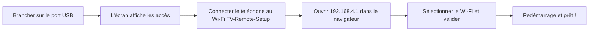
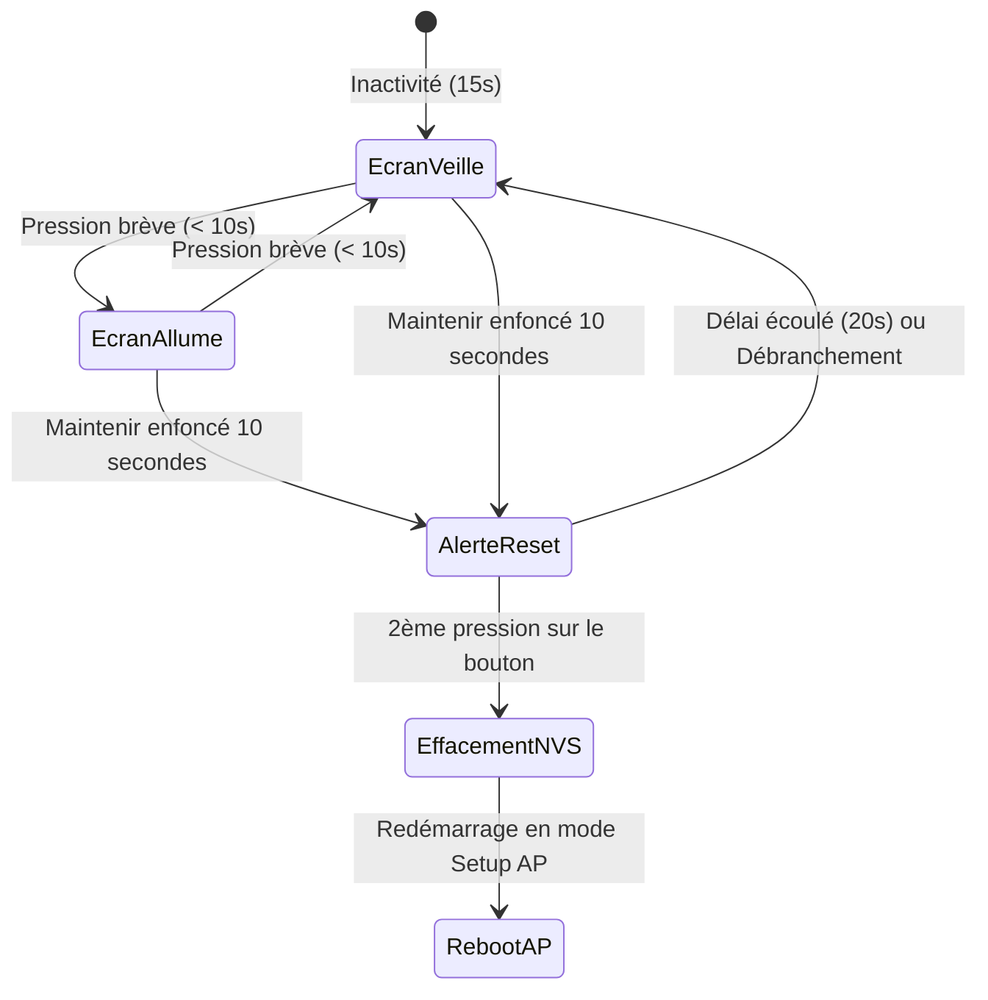

# Télécommande TV & Clavier Virtuel LilyGO T-Dongle-S3 — Guide de l'utilisateur

Bienvenue dans le manuel d'utilisation de votre **Télécommande TV et Clavier sans fil LilyGO T-Dongle-S3**. Ce dispositif transforme votre clé USB LilyGO en une télécommande matérielle USB HID et un clavier sans fil à latence ultra-faible pour votre Smart TV, boîtier multimédia ou ordinateur de salon, contrôlable depuis n'importe quel smartphone, tablette ou navigateur web.

---

## Table des matières
1. [Présentation et Fonctionnalités](#1-présentation-et-fonctionnalités)
2. [Configuration matérielle requise et Compatibilité](#2-configuration-matérielle-requise-et-compatibilité)
3. [Première configuration (Configuration Wi-Fi)](#3-première-configuration-configuration-wi-fi)
4. [Utilisation de la Télécommande Web](#4-utilisation-de-la-télécommande-web)
5. [Installation sous forme d'application web (PWA)](#5-installation-sous-forme-dapplication-web-pwa)
6. [Bouton physique et Réinitialisation d'usine](#6-bouton-physique-et-réinitialisation-dusine)
7. [Architecture de Sécurité et Chiffrement](#7-architecture-de-sécurité-et-chiffrement)
8. [Dépannage et Foire Aux Questions (FAQ)](#8-dépannage-et-foire-aux-questions-faq)

---

## 1. Présentation et Fonctionnalités

- **Contrôle USB HID sans pilote (Driverless)** : Émule un clavier USB standard et un contrôleur multimédia grand public. Se branche directement sur n'importe quel port USB sans nécessiter l'installation de pilotes ou d'applications sur le téléviseur.
- **Barrière de proximité physique** : Protège le point d'accès de configuration par un mot de passe aléatoire de 8 caractères généré par le générateur de nombres aléatoires matériel (TRNG) de l'ESP32-S3 et affiché **uniquement** sur l'écran couleur LCD intégré.
- **Stockage chiffré au niveau matériel** : Les identifiants de votre réseau Wi-Fi sont chiffrés en **AES-256 CTR** à l'aide d'une clé dérivée par le **périphérique HMAC matériel** de l'ESP32-S3 (`KEY0` à `KEY5`). Aucun mot de passe en clair n'est jamais stocké dans la mémoire flash.
- **Télécommande Web en temps réel** : Réactivité instantanée grâce au protocole WebSocket (`ws://<ip>:81`) avec basculement automatique en HTTP REST (`http://<ip>:80`).
- **Saisie de texte en direct (Live Typing)** : Saisissez vos recherches, identifiants et URL directement depuis le clavier virtuel de votre smartphone vers la télévision.
- **Application Web Progressive (PWA)** : S'installe directement sur l'écran d'accueil de votre téléphone avec une icône néon personnalisée et une interface plein écran immersive.
- **Gestion intelligente de l'énergie et de l'affichage** : Écran LCD IPS 160×80 haute lisibilité avec mise en veille automatique après 15 secondes en fonctionnement normal, et rétroéclairage permanent en mode configuration.

---

## 2. Configuration matérielle requise et Compatibilité

### Périphériques cibles compatibles
Le T-Dongle-S3 est compatible avec tout appareil prenant en charge les claviers USB HID standards :
- **Téléviseurs connectés (Smart TV)** : LG webOS, Samsung Tizen, Sony Bravia, TCL, Hisense, etc.
- **Boîtiers et passerelles multimédias** : Android TV, Google TV (Chromecast avec Google TV via hub USB/OTG), Nvidia Shield TV, Fire TV (via câble OTG), Apple TV (via adaptateur USB-C).
- **Ordinateurs et centres multimédias** : Windows, macOS, Linux, Raspberry Pi (Kodi, LibreELEC, Plex).
- **Consoles de jeux** : PS4, PS5, Xbox One, Xbox Series X/S (navigation basique dans les menus et claviers virtuels).

### Caractéristiques du dongle
- **Microcontrôleur** : ESP32-S3 double cœur Xtensa LX7 cadencé à 240 MHz.
- **Écran** : Écran couleur ST7735 de 0,96 pouce (80×160 pixels, rétroéclairage actif à l'état BAS sur GPIO 38).
- **Bouton physique** : Bouton multifonction connecté sur le GPIO 0.
- **Connecteur** : Fiche USB Type-A mâle.

---

## 3. Première configuration (Configuration Wi-Fi)

À la première mise sous tension — ou si le dongle ne parvient pas à se connecter au réseau Wi-Fi enregistré — il active automatiquement le **Mode Point d'Accès (Setup AP)**.



### Étape 1 : Brancher le dongle
Insérez le T-Dongle-S3 dans un port USB disponible de votre téléviseur, de votre box de streaming ou d'un chargeur USB.

### Étape 2 : Lire les identifiants sur l'écran
L'écran LCD s'allume immédiatement et affiche les informations suivantes :
- **Bandeau supérieur bleu** : `Living Room TV` (ou le nom de pièce configuré)
- **Texte Cyan** : `WiFi: TV-Remote-Setup`
- **Gros caractères jaunes** : `Pass: <Mot de passe aléatoire de 8 caractères>` (ex. `k9X2mQ8p`)
- **Pied de page blanc** : `http://192.168.4.1`

> [!NOTE]
> Le mot de passe de configuration est généré de manière aléatoire à chaque démarrage non configuré via le TRNG matériel de l'ESP32-S3. Comme il n'apparaît que sur l'écran physique du dongle, personne ne peut s'y connecter depuis l'extérieur de votre pièce.

### Étape 3 : Se connecter au réseau du dongle
1. Sur votre smartphone, tablette ou ordinateur portable, ouvrez les **Paramètres Wi-Fi**.
2. Sélectionnez le réseau nommé **`TV-Remote-Setup`**.
3. Saisissez le **mot de passe de 8 caractères** affiché sur l'écran du dongle.

### Étape 4 : Ouvrir le portail de configuration
1. Lancez votre navigateur web préféré (Safari, Chrome, Firefox, Edge).
2. Rendez-vous à l'adresse : **`http://192.168.4.1`** (ou `http://192.168.4.1/setup`).
3. La page de configuration s'affiche :
   - **Mode de fonctionnement** : Choisissez **"Connect to existing Wi-Fi"** (mode Client) ou **"Standalone Access Point"** (crée son propre réseau Wi-Fi autonome sans routeur).
   - Sélectionnez ou entrez le SSID et le mot de passe Wi-Fi.
   - *(Optionnel)* Modifiez le **Nom de la pièce** (ex. `Salon`, `Chambre`, `Home Cinéma`).
   - *(Optionnel)* Modifiez le **Nom d'hôte mDNS** (par défaut : `tv-remote`).
   - *(Optionnel)* **Restreindre l'accès à la télécommande** : Cochez **"Restrict access to approved devices only"** pour exiger une confirmation par le bouton physique avant qu'un nouveau téléphone ne puisse envoyer des touches.
4. Cliquez sur **"Save & Connect"**.

### Étape 5 : Connexion établie
Le dongle chiffre immédiatement vos identifiants à l'aide de clés dérivées matériellement en AES-256 CTR (avec validation stricte fail-closed) et redémarre. En quelques secondes, l'écran affiche :
- **Texte Vert** : `WiFi: <Nom de votre réseau>` (ou `AP: <Nom de votre SSID>`)
- **Texte Jaune** : `http://<Adresse IP>`
- **Texte Cyan** : `http://<nom-d-hote>.local`


---

## 4. Utilisation de la Télécommande Web

Une fois le dongle connecté à votre réseau domestique, ouvrez votre navigateur depuis n'importe quel appareil connecté au même Wi-Fi et accédez à :
```text
http://tv-remote.local
```
*(Si votre routeur ou votre réseau ne gère pas le protocole mDNS, saisissez directement l'adresse IP affichée sur l'écran du dongle, par exemple `http://192.168.1.125`.)*

### Disposition et Fonctions des Touches

| Groupe de boutons | Touches | Fonction |
| :--- | :--- | :--- |
| **Alimentation & Système** | `POWER`, `MUTE` | Veille/Réveil de l'écran, Activer/Désactiver le son |
| **Pavé directionnel** | `▲`, `▼`, `◄`, `►` | Navigation dans les menus, grilles et listes de la TV |
| **Sélection** | `SELECT / OK` | Touche Entrée / Validation de l'élément sélectionné |
| **Navigation** | `BACK`, `HOME` | Retour arrière (Échap), Retour à l'écran d'accueil TV |
| **Contrôle du Volume** | `VOL +`, `VOL -` | Augmenter ou diminuer le volume sonore |
| **Lecture Multimédia** | `⏮`, `⏯`, `⏭` | Piste précédente, Lecture/Pause, Piste suivante |
| **Raccourcis d'applications** | `YouTube`, `Netflix` | Raccourcis directs vers les applications prises en charge |

### Saisie de texte en direct (Live Typing)
Rechercher une vidéo ou saisir un mot de passe avec une télécommande classique est souvent fastidieux. La zone **Live Typing** simplifie cela :
1. Touchez le champ **"Type search or text..."** dans la télécommande web.
2. Écrivez avec le clavier complet de votre smartphone (avec saisie vocale et suggestions automatiques).
3. Touchez **Send** pour envoyer la chaîne complète d'un seul coup vers la TV, ou activez la saisie en direct pour répliquer chaque frappe instantanément.

---

## 5. Profils d'appareils et Studio de Macros (Companion App)
Le microprogramme intègre une application compagnon universelle permettant de concevoir des télécommandes sur mesure, des touches macros et des pavés de commande multi-pages.

### Accéder au Studio
Vous pouvez accéder au studio de deux manières simples :
- **Directement depuis le dongle** : Rendez-vous sur `http://tv-remote.local/designer` (ou cliquez sur *"Open Layout & Macro Designer"* sur la page de configuration).
- **En local / Hors-ligne** : Ouvrez `companion/index.html` dans n'importe quel navigateur web sur votre ordinateur, Mac ou tablette.

### Fonctionnalités principales
1. **Profils multi-pages par appareil** :
   - Créez des dispositions personnalisées pour différents appareils : téléviseurs connectés, PC Windows, Mac Apple, Kodi ou Android TV.
   - Organisez vos boutons en sous-pages (ex. *Navigation*, *Pavé numérique*, *Multimédia*, *Raccourcis*).
   - Définissez le nombre de colonnes de la grille (2 à 6 colonnes) et la largeur des touches (1x1, 2x1 large, pleine largeur).
2. **Moteur de macros hybride DuckyScript** :
   - Chaque touche peut déclencher une frappe HID unique ou une **macro multi-étapes en DuckyScript**.
   - Utilisez le **Générateur visuel** pour assembler vos étapes (*Saisir du texte*, *Combinaison de touches*, *Délai*, *Touche Entrée*) ou écrivez directement le script DuckyScript dans l'éditeur de texte.
   - Prend en charge : `STRING <texte>`, `DELAY <ms>`, `GUI <touche>`, `CTRL <touche>`, `ALT <touche>`, `SHIFT <touche>`, `REPEAT <n>`, et les touches multimédia (`VOL_UP`, `MUTE`, `PLAY_PAUSE`).
3. **Double stockage (Mémoire Flash interne & MicroSD)** :
   - Les profils sont sauvegardés dans la mémoire flash **LittleFS** interne de l'ESP32-S3.
   - Si une carte MicroSD est insérée dans le lecteur TF du T-Dongle-S3, le microprogramme la détecte automatiquement.
4. **Déploiement sur le dongle** :
   - Cliquez sur **"Deploy to LilyGO"** pour téléverser le profil directement en Wi-Fi.
   - **Sécurité d'appairage obligatoire** : La gestion et le téléversement de profils exigent une confirmation physique. Cliquez sur *"Pair Dongle"* dans le studio, puis appuyez sur le bouton physique du dongle pour autoriser l'accès.
5. **Changement rapide de profil** :
   - Sur la **page de configuration** (`http://tv-remote.local/setup`), sélectionnez le profil désiré dans le menu déroulant *"Active Remote Profile"* et cliquez sur *"Switch Active"*. L'interface de télécommande se met à jour instantanément.

---

## 6. Installation sous forme d'application web (PWA)


Vous pouvez installer la télécommande comme une véritable application sur votre smartphone, sans passer par un magasin d'applications.

### Sur Apple iOS (iPhone & iPad)
1. Ouvrez **Safari** et accédez à `http://tv-remote.local`.
2. Appuyez sur le bouton de **Partage** (l'icône carrée avec une flèche vers le haut en bas de l'écran).
3. Faites défiler les options et sélectionnez **"Sur l'écran d'accueil"**.
4. Validez le nom (ex. `Télécommande TV`) puis appuyez sur **Ajouter**.
5. L'icône néon personnalisée s'affiche sur votre écran d'accueil. Un simple appui ouvre la télécommande en plein écran, sans barre d'adresse ni onglets.

### Sur Google Android (Samsung, Xiaomi, Pixel, etc.)
1. Ouvrez **Google Chrome** et accédez à `http://tv-remote.local`.
2. Appuyez sur le menu **Trois points (⋮)** en haut à droite.
3. Sélectionnez **"Ajouter à l'écran d'accueil"** ou **"Installer l'application"**.
4. Confirmez l'installation. L'application démarre désormais comme une application native indépendante.

---

## 7. Bouton physique et Réinitialisation d'usine


Le bouton physique situé sur le dessus du T-Dongle-S3 propose deux modes de fonctionnement :



### 1. Veille / Réveil de l'écran & Approbation d'appairage (Pression brève)
- **Veille / Réveil** : Appui bref (< 1 seconde) pour allumer ou éteindre manuellement l'écran LCD. En fonctionnement normal, l'écran s'éteint automatiquement après **15 secondes** pour ne pas gêner dans l'obscurité.
- **Approbation physique d'un appareil** : Si l'option "Restreindre l'accès" est activée et qu'un nouvel appareil demande l'accès, l'écran affiche une alerte jaune :
  ```text
  PAIRING REQUEST
  Press button to approve
  Timeout in 30s
  ```
  **Appuyez brièvement sur le bouton (< 10 secondes)** pour autoriser l'appareil. L'écran affiche `"DEVICE APPROVED!"` en vert et délivre un jeton HMAC cryptographique sauvegardé dans le `localStorage` du navigateur.

### 2. Procédure de Réinitialisation d'usine sécurisée (Maintien de 10 secondes)
Pour éviter toute réinitialisation accidentelle, une confirmation en deux étapes est requise :
1. **Maintenez le bouton enfoncé pendant 10 secondes consécutives**.
2. L'écran devient rouge et affiche un avertissement clair :
   ```text
   ! FACTORY RESET !
   Press button to reset
   to factory default.
   Unplug to cancel.
   ```
3. **Pour confirmer la réinitialisation** : Appuyez une **deuxième fois** sur le bouton. L'écran affiche `"Reset Complete! Rebooting..."`, efface les identifiants réseau de la mémoire flash NVS et redémarre en mode point d'accès.
4. **Pour annuler** : Débranchez simplement le dongle, ou attendez 20 secondes sans toucher au bouton pour que l'opération s'annule d'elle-même.

> [!IMPORTANT]
> La réinitialisation d'usine efface uniquement les données réseau de la mémoire NVS, mais **conserve intacte la clé matérielle eFuse HMAC**. Vous ne risquez jamais de bloquer ou d'épuiser les fusibles matériels en réinitialisant le dongle.

---

## 8. Architecture de Sécurité et Chiffrement


L'appareil intègre des standards de sécurité matérielle rigoureux :

1. **Aucun identifiant en clair & Sauvegarde Fail-Closed** :
   - Ni le code source ni les binaires compilés ne contiennent votre SSID ou mot de passe.
   - Les identifiants stockés en mémoire flash sont protégés par un chiffrement **AES-256 en mode CTR**.
   - **Garantie Fail-Closed** : Si le coprocesseur matériel HMAC ou la validation cryptographique échoue, l'appareil refuse d'écrire dans la mémoire NVS, affiche une alerte rouge sur l'écran et retourne une erreur HTTP 500.

2. **Clé maître dérivée par le coprocesseur matériel HMAC de l'ESP32-S3** :
   - Les clés sont calculées directement par le périphérique interne **HMAC** (`esp_hmac.h`).
   - La clé maître est hébergée dans un bloc eFuse dédié et protégé en lecture (`KEY0` à `KEY5`) configuré pour `ESP_EFUSE_KEY_PURPOSE_HMAC_UP`.
   - Le microprogramme détecte automatiquement la présence d'une clé HMAC existante au démarrage et **la réutilise immédiatement** sans griller de nouveaux eFuses.
   - Une séparation de domaine stricte est appliquée avec des contextes distincts :
     - `"project-wifi-v1"` : Pour le chiffrement des identifiants stockés.
     - `"project-auth-v1"` : Pour la signature et vérification des jetons d'appairage.

3. **Barrière de proximité physique & Appairage d'appareils** :
   - Le point d'accès initial génère un mot de passe aléatoire de 8 caractères affiché **exclusivement sur l'écran LCD physique**.
   - **Appairage d'appareils (Méthode B)** : Lorsque la restriction d'accès est activée, un nouvel appareil ne peut envoyer aucune commande tant qu'il n'a pas été validé par un appui physique sur le bouton du dongle.
   - **Isolation du mode Setup** : En mode configuration initiale, la racine `/` redirige strictement vers `/setup` ; aucune touche de télécommande n'est accessible avant la fin de la configuration.

4. **Chiffrement des touches en transit (WebCrypto AES-CTR)** :
   - Les frappes de touches envoyées par WebSocket et HTTP sont chiffrées dans le navigateur de l'utilisateur via l'API WebCrypto avant d'être transmises (`E:<nonce>:<ciphertext>`).


---

## 9. Dépannage et Foire Aux Questions (FAQ)


### L'écran reste complètement noir. Que faire ?
1. Assurez-vous que le dongle est convenablement inséré dans un port USB alimenté.
2. Effectuez un appui court sur le bouton physique pour sortir de veille.
3. Sur le LilyGO T-Dongle-S3, la ligne de rétroéclairage sur le GPIO 38 fonctionne en logique inversée (**Active LOW**). Assurez-vous d'utiliser le firmware avec `LCD_BACKLIGHT_ON = LOW`.

### La télévision ne réagit pas aux commandes de la télécommande web.
1. Vérifiez que le dongle est branché directement sur un port USB du téléviseur (et non sur un adaptateur secteur distant).
2. Vérifiez si votre télévision accepte les claviers USB : branchez un clavier USB filaire ordinaire sur le même port. Si les touches fléchées et la touche Entrée fonctionnent, le T-Dongle-S3 fonctionnera à l'identique.
3. Certains ports USB de téléviseurs sont réservés à la maintenance ("Service") ou aux disques durs ("HDD"). Essayez un autre port USB à l'arrière ou sur le côté de l'écran.

### Je n'arrive pas à ouvrir `http://tv-remote.local`.
1. Vérifiez que votre smartphone ou ordinateur est connecté au **même réseau Wi-Fi (bande 2,4 GHz)** que le dongle.
2. Certains réseaux Wi-Fi invités ou routeurs d'entreprise activent l'isolation des clients (AP Isolation) ou bloquent le protocole mDNS (`.local`).
3. Si le nom d'hôte ne répond pas, consultez l'adresse IP affichée sur l'écran du dongle et saisissez-la directement dans la barre d'adresse de votre navigateur (ex. `http://192.168.1.125`).

### Comment changer le réseau Wi-Fi du dongle ?
Effectuez une réinitialisation d'usine :
1. Maintenez le bouton physique enfoncé pendant **10 secondes** jusqu'à l'affichage de l'écran rouge.
2. Relâchez puis appuyez à nouveau brièvement sur le bouton pour confirmer.
3. Le dongle redémarre en mode `TV-Remote-Setup` avec un nouveau mot de passe sur l'écran, vous permettant de le reconnecter à un autre réseau.
